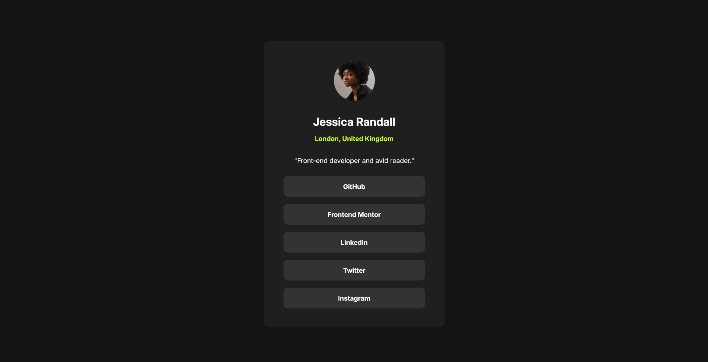

# Frontend Mentor - Social links profile solution

This is a solution to the [Social links profile challenge on Frontend Mentor](https://www.frontendmentor.io/challenges/social-links-profile-UG32l9m6dQ). Frontend Mentor challenges help you improve your coding skills by building realistic projects. 

## Table of contents

- [Overview](#overview)
  - [The challenge](#the-challenge)
  - [Screenshot](#screenshot)
  - [Links](#links)
  - [Built with](#built-with)
- [Author](#author)

## Overview

Social Link Profile | First solution using CSS and Flexbox

### The challenge

Users should be able to:

- See hover and focus states for all interactive elements on the page

### Screenshot

### Links

- Solution URL: [https://github.com/k-hroma/Social-Link-Profile.git]
- Live Site URL: [https://k-hroma.github.io/Social-Link-Profile/]

## My process

### Built with

- Semantic HTML5 markup
- CSS custom properties
- Flexbox

## Author

- Website - [Rocío Mendonca](https://www.linkedin.com/in/rocio-mendonca-gainza-/)
- Frontend Mentor - [@k-hroma](https://www.frontendmentor.io/profile/k-hroma)
